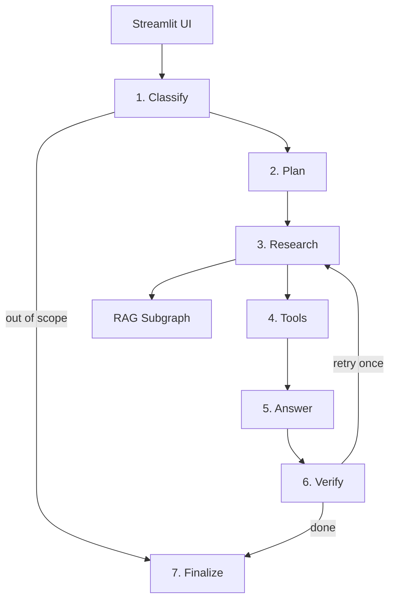
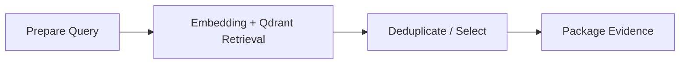

# EU AI Act Compliance Copilot

A local Agentic RAG prototype for researching EU AI Act questions with traceable sources.

The system answers EU AI Act research questions from a pinned official corpus, performs preliminary deterministic risk/date checks, and exposes the agent workflow and retrieved evidence in a Streamlit UI.

Download the pinned data sources with:
```powershell
python scripts/download_sources.py
```

> This prototype provides preliminary compliance research, not legal advice.

## Disclosures:
The core idea of this project - an EU AI Act compliance/research assistant - and its high-level architecture is my own. I've chosen this domain because I've studied the EU AI Act in my Masters, so I was able to evaluate the generated content, and legal decision support (used responsibly with an expert human oversight) could be a real life use case for a system like this. Unlike most of my earlier and subsequent work, a significant part of this prototype's implementation and documentation was produced with generative-AI assistance. I reviewed, executed, debugged, and tested the resulting system, made implementation changes where needed, and understand the main concepts and design decisions behind it.
However, this should be considered a time-constrained prototype (rather than a production-grade compliance system).
In particular:
- The evaluation set is small and primarily intended as a regression check.
- The retrieval metric is based on expected text markers and may overestimate retrieval quality.
- The deterministic verification step validates evidence/citation structure rather than legal entailment.
- The recorded load test is a single-concurrency baseline.
- The risk-triage logic is incomplete. Dense retrieval currently has no reranker.
- Used prompts were not documented as this wasn't a requirement for completing the task, but in a real life solution this could be a necessary documentation if generative AI is used to complete a task.
- Also see `15. Limitations` section in this document.

For a concrete production use case, I would design a substantially more rigorous domain-specific evaluation set, including edge cases and adversarial cases, stronger retrieval, and appropriate expert and/or legal review.

## 1. Problem and Objective

### Context

EU AI Act compliance questions require users to connect definitions, scope, risk categories, obligations, annexes and staged application dates. The underlying legal text is long and has been amended, so a normal generative chatbot can easily rely on stale knowledge or unsupported memory.

### Intended users

The target user is an engineering, product, governance or compliance professional who needs a quick first-pass answer such as:

- Does this use case appear to fall within AI Act scope?
- Is this use case a potential high-risk system?
- Which provisions are relevant?
- What obligations should be investigated?
- When does a rule apply?
- Which official source supports the answer?

### Why Agentic RAG here?

A single question often requires multiple actions: classify the request, split it into research tasks, retrieve several legal provisions, run deterministic checks, synthesize a cited answer and verify the citations. LangGraph makes these steps explicit and stateful rather than hiding them in one prompt.

## 2. Scope

The prototype covers general EU AI Act research with emphasis on:

- scope and definitions;
- preliminary high-risk triage;
- prohibited-practice questions;
- provider/deployer and high-risk obligations;
- transparency;
- staged application dates.

### Non-goals

- legal advice or formal conformity assessment;
- exhaustive treatment of all sectoral EU legislation;
- national implementation law;
- live web search;
- automatic regulatory monitoring;
- full GPAI Code of Practice analysis;
- production authentication, multi-tenancy or audit infrastructure.

## 3. Data Sources

The repository contains three official English PDFs under `data/raw/`:

1. **Regulation (EU) 2024/1689 - consolidated text as of 27 July 2026**  
   EUR-Lex PDF: https://eur-lex.europa.eu/legal-content/EN/TXT/PDF/?uri=CELEX%3A02024R1689-20260727
2. **Commission Guidelines on prohibited artificial intelligence practices**  
   Official Commission page: https://digital-strategy.ec.europa.eu/en/library/commission-publishes-guidelines-prohibited-artificial-intelligence-ai-practices-defined-ai-act
3. **Commission Guidelines on the definition of an artificial intelligence system**  
   Official Commission page: https://digital-strategy.ec.europa.eu/en/library/commission-publishes-guidelines-ai-system-definition-facilitate-first-ai-acts-rules-application

The consolidated Regulation is the primary retrieval source. The Commission guidelines are secondary, non-binding practical guidance.

See [`docs/DATA_SOURCES.md`](docs/DATA_SOURCES.md) for exact PDF links, hashes and processing details.

## 4. Model Selection

### Generation: `qwen3.8:latest`

The generation model runs locally through Ollama, so the prototype uses no paid API. A large Qwen model is appropriate for structured routing and cited synthesis, while the main trade-off is local memory use and latency. The performance test measures that cost instead of hiding it.

### Embeddings: `embeddinggemma:latest`

EmbeddingGemma is a small 300M-class multilingual embedding model available through Ollama. The model produces 768-dimensional embeddings and was trained across more than 100 languages, which is useful because users can ask in Hungarian while the legal corpus is English.

References:

- https://ollama.com/library/embeddinggemma
- https://ai.google.dev/gemma/docs/embeddinggemma

## 5. Architecture



The main LangGraph has seven nodes and includes:

- autonomous structured routing;
- task decomposition;
- shared state;
- conditional edges;
- one bounded retry;
- two deterministic tools;
- a separate modular RAG subgraph.

### RAG Subgraph



See [`docs/ARCHITECTURE.md`](docs/ARCHITECTURE.md).

## 6. Tools

### `risk_triage_tool`

A deterministic keyword/rule based preliminary classifier. It can flag a described use case as a candidate for:

- prohibited-practice review;
- Annex III high-risk review;
- Article 50-style transparency review.

It never claims to be the legal conclusion. The generated answer must confirm the tool output with retrieved evidence.

### `application_date_tool`

Reads curated application dates from `data/rules/effective_dates.yaml` and calculates whether a selected rule is applicable on the requested `as_of` date.

This avoids asking the LLM to perform deterministic date logic.

## 7. RAG Implementation

1. PyMuPDF extracts text from the PDF corpus.
2. Text normalization removes common legal-PDF header noise and joins line-break hyphenation.
3. Article/Annex/Chapter headings are tracked where possible.
4. Text is chunked to roughly 2,200 characters with a small overlap.
5. `embeddinggemma:latest` generates document embeddings.
6. Qdrant local mode stores vectors plus page/source/section metadata.
7. Each research task runs through the RAG subgraph.
8. The main graph deduplicates hits, keeps the strongest evidence and assigns `[S1]` style citation IDs.
9. The answer prompt is only allowed to make regulatory claims from supplied evidence.
10. The verification node rejects missing/invalid citations and permits one retrieval retry.

Qdrant local mode was chosen to avoid an unnecessary separate database service while still using a real vector database API and persistent on-disk index.

## 8. Project Structure

```text
eu-ai-act-copilot/
├── app/
│   ├── agent_graph.py
│   ├── config.py
│   ├── ingestion.py
│   ├── rag_graph.py
│   ├── retrieval.py
│   ├── schemas.py
│   ├── text_processing.py
│   ├── tools.py
│   └── ui.py
├── data/
│   ├── eval/questions.json
│   ├── raw/*.pdf
│   ├── rules/effective_dates.yaml
│   └── sources.yaml
├── docs/
│   ├── ARCHITECTURE.md
│   ├── DATA_SOURCES.md
│   ├── EVALUATION.md
│   └── RUNBOOK.md
├── results/
├── scripts/
│   ├── download_sources.py
│   ├── evaluate.py
│   ├── ingest.py
│   ├── load_test.py
│   ├── run_submission.ps1
│   └── smoke_test.py
├── tests/
├── Dockerfile
├── docker-entrypoint.sh
├── requirements.txt
└── README.md
```

## 9. Windows / PowerShell Installation

Assumptions:

- Python 3.12
- Ollama 0.32.15 is already running
- `qwen3.8:latest` (27B LLM) is available
- `embeddinggemma:latest` (embedding model) is available

```powershell
python -m venv .venv
.\.venv\Scripts\Activate.ps1
python -m pip install --upgrade pip
pip install -r requirements.txt
Copy-Item .env.example .env
```

Build the vector index:

Download the pinned source documents and build the vector index:

```powershell
python scripts/download_sources.py
python scripts/ingest.py
```

Run tests and a retrieval smoke test:

```powershell
python -m pytest -q
python scripts/smoke_test.py
```

Start the UI:

```powershell
streamlit run app/ui.py
```

Open:

```text
http://localhost:8501
```

See [`docs/RUNBOOK.md`](docs/RUNBOOK.md) for the full runbook.

## 10. Docker

The application is packaged in one container. Qdrant runs in local mode inside the application, while Ollama is expected to run on the Windows host.

Build:

```powershell
docker build -t eu-ai-act-copilot .
```

Run:

```powershell
docker run --rm -p 8501:8501 eu-ai-act-copilot
```

The container uses `http://host.docker.internal:11434` to reach Ollama on Windows. On first start it builds the vector index and then launches Streamlit.

There is no `docker-compose.yml` because the prototype has only one containerized component.

## 11. Functional Evaluation

The functional evaluation uses **15 curated questions** from `data/eval/questions.json`.

Run:

```powershell
python scripts/evaluate.py
```

Generated files:

```text
results/evaluation.json
results/evaluation.md
```

Metrics:

- intent accuracy;
- retrieval hit rate;
- citation presence rate;
- deterministic verification pass rate;
- mean / p50 / p95 latency.

This provides regression signals for routing, marker-based retrieval and answer traceability. The retrieval check passes when any configured expected marker is present, and the deterministic verification gate checks citation/evidence structure rather than whether every cited source semantically entails the corresponding claim. These metrics are therefore not presented as proof of retrieval completeness or legal correctness.

### Latest Local Evaluation Result

<!-- EVALUATION_RESULTS_START -->
| Metric | Result |
|---|---:|
| Questions | 15 |
| Intent accuracy | 93.3% |
| Retrieval hit rate | 92.9% |
| Citation presence rate | 100.0% |
| Verification pass rate | 100.0% |
| p50 latency | 30466 ms |
| p95 latency | 46540 ms |

Full report (including failed cases): `results/evaluation.md`.
<!-- EVALUATION_RESULTS_END -->

## 12. Load Scenario

The load scenario runs 50 full agent requests by default (the script accepts 50-200):

```powershell
python scripts/load_test.py --requests 50 --concurrency 1
```

Generated files:

```text
results/load_test.json
results/load_test.md
```

The report contains:

- success/error count;
- throughput;
- mean latency;
- p50 / p95 / p99 latency;
- average latency by LangGraph node;
- the measured main bottleneck;
- 1-2 optimization suggestions.


### Latest Local Load-Test Result

<!-- LOAD_RESULTS_START -->
| Metric | Result |
|---|---:|
| Requests | 50 |
| Concurrency | 1 |
| Errors | 0 |
| p50 latency | 30465 ms |
| p95 latency | 48403 ms |
| p99 latency | 62254 ms |
| Bottleneck | `answer` |

Full report: `results/load_test.md`.
<!-- LOAD_RESULTS_END -->

## 13. Performance Optimization Candidates

The recorded load test identifies the `answer` node as the main bottleneck (22.3 s mean latency, compared with 9.9 s for `classify` and about 50 ms for `research`).

Concrete optimization candidates:

1. use a smaller or quantized local model for final answer synthesis, or reduce the maximum generated response length;
2. reduce `MAX_EVIDENCE` / the amount of retrieved context passed to the `answer` node after validating retrieval quality on the evaluation set.

If retrieval is the measured bottleneck:

1. reduce `RETRIEVAL_TOP_K` / `MAX_EVIDENCE` after checking retrieval recall;
2. cache query embeddings and repeated retrieval results.

## 14. Reproducibility

The repository pins the corpus with SHA256 hashes in `data/sources.yaml`. `scripts/download_sources.py` can download the pinned official files and refuses silent upstream changes.

## 15. Limitations

- Deterministic risk triage is intentionally incomplete and preliminary.
- Dense vector retrieval has no reranker in order to keep the prototype small.
- PDF extraction may not preserve every visual relationship or table layout perfectly.
- The corpus is a pinned snapshot, not a live legal monitoring service.
- Commission guidelines are non-binding.
- A correct citation does not automatically prove that the generated interpretation is legally correct.

## 16. Suggested Demo Questions

```text
Is an AI system that ranks CVs and job candidates high-risk?
When do the Annex III high-risk requirements apply?
What transparency obligations can apply to an AI chatbot?
Is social scoring prohibited under the EU AI Act?
Milyen átláthatósági kötelezettségek vonatkozhatnak egy AI chatbotra?
```
