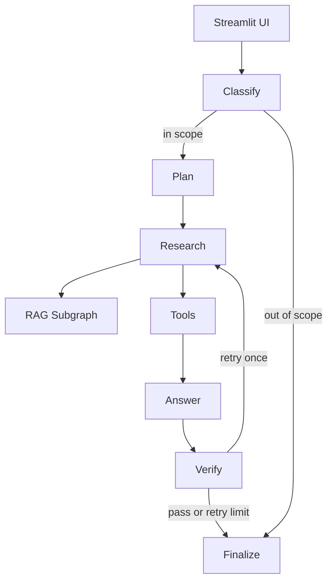
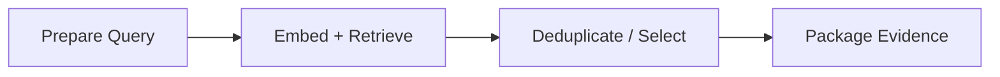

# Architecture

## Overview

The prototype uses an explicit LangGraph workflow instead of an unconstrained ReAct loop. This keeps the control flow inspectable, testable, and easy to explain.

The main graph has seven nodes.

## Main Graph Nodes

### `classify`

Uses the local LLM with structured output to decide:

- whether the request is in scope;
- the request intent;
- one to three research tasks;
- whether deterministic risk/date tools are needed.

If structured output fails, a small deterministic fallback router is used.

### `plan`

Normalizes and limits the decomposed research tasks. This gives an explicit task-decomposition step while keeping the number of LLM calls low.

### `research`

Executes every research task through the dedicated RAG subgraph, deduplicates results, ranks by vector similarity, and assigns citation IDs.

### `tools`

Runs deterministic tools when requested by the router:

- `risk_triage_tool` - preliminary rule-based risk signal;
- `application_date_tool` - deterministic application-date calculation from curated rules.

### `answer`

The LLM synthesizes an answer from retrieved evidence and tool results. Legal claims must cite `[S1]`, `[S2]`, etc.

### `verify`

A deterministic guard checks that evidence exists and that citation IDs in the generated answer are valid. One retrieval retry is allowed.

### `finalize`

Formats the answer, source URLs, verification warning if needed, and the non-legal-advice disclaimer.

## RAG Subgraph

The RAG subsystem is implemented as a separate LangGraph subgraph and is called from the main workflow.

## State Management

`AgentState` stores intermediate values including:

- routing decision;
- research tasks;
- retrieved evidence;
- tool results;
- draft answer;
- verification result;
- retry count;
- per-node execution trace.

This makes the workflow observable without exposing private model reasoning.

## Why No Reranker / FastAPI / docker-compose?

They are useful production options but not required for this prototype. The assignment rewards a working, reproducible and explainable solution. Qdrant local mode avoids an extra service, Streamlit directly invokes LangGraph, and dense retrieval keeps the dependency/runtime surface small.
